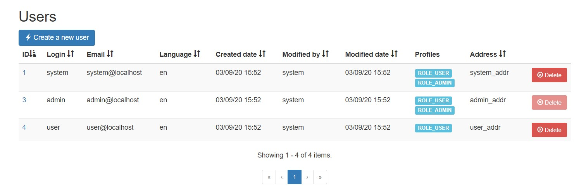

# e2e-app

This project has the goal to assess the development skills of a Junior Full-Stack Developer. The candidate has to complete certain exercises within a deadline. The exercises require a knowledge background on Java Spring and AngularJS. Familiarization with MySQL and Git is also needed.

These instructions include everything the candidate needs to know on how to download the sources of this simple web application on a personal computer as well as how to deploy and run it. The instructions begin with going through the installation process. After the application is successfully installed and running, the candidate is ready to start with the exercises that follow. Each exercise awards a different amount of points totaling 100 points.

The use of any IDE and/or editor to edit the source code is allowed. It is totally acceptable, that the candidate gets any help and information he/she needs from the internet. It is not however acceptable to ask for another person's help.

Nevertheless, the candidate is encouraged to contact the assessor for any questions he/she might have, be it he/she needs any additional information, or he/she requires some help for completing the installation and/or an exercise. If the candidate has difficulties for example to complete the installation, he/she could ask for help from the assessor in order to be able to go on with the exercises and gain points.

The assessor should provide contact information to the candidate.

This application was generated using [JHipster](https://jhipster.github.io). This tool generates a handful of files in order to create an app. The candidate has to locate these files to complete the exercises. The exercises cover both front-end and back-end implementation tasks.

## Installation

To install and run the application an active internet connection is required. 
Before you can build this project, you must install and configure the following dependencies on your machine:

1: <ins>JDK 1.8</ins> Download and install any version of the JDK 1.8. Install JDK in a folder whose path does not contain spaces.
Make sure to also set the environmental variable JAVA_HOME in your system. The variable must point to your JDK folder (absolute path). The path of the "\jre\bin" folder under the JDK folder should also be **prepended** to the PATH system variable.

2: <ins>Maven Version 3.x</ins> Download and install any version of Maven 3. Install Maven in a folder whose path does not contain spaces.
Make sure to also set the environmental variables M2_HOME and M2 in your system. The M2_HOME variable must point to the maven folder (absolute path). The M2 variable must point to the "bin" folder under the maven folder (absolute path). The absolute path of the "bin" folder under the maven folder (M2) should also be **prepended** to the PATH system variable.

3: <ins>MySQL Server 5.x</ins> Download and install a version of MySQL 5. In case you download a greater version you will have to update the dependency in the pom.xml as well.

4: <ins>Git</ins> You need to install Git client to clone the sources of the application and push your solution at the end.

5: <ins>DBeaver</ins> You will need a database client in order to interact with the MySQL database. Feel free to use whatever database client you like or you might already have. DBeaver is our suggestion.

6: Download the sources of the application. If you installed Git client in the previous step, then navigate with the command line to a folder in which you want to download the source code. Run the following command:

    git clone https://github.com/Novolos01/e2e-app.git

In any case, make sure that the folder with the application's sources is saved under a path that does not contain spaces.

7: Node.js (Optional) Node.js is used to run a development web server and build the project. Depending on your system, you can install Node.js either from source or as a pre-packaged bundle.

8: (Optional) After installing Node, you should be able to run the following command to install development tools (like Bower and BrowserSync). You will only need to run this command when dependencies change in package.json.

   Install the Gulp command-line tool globally with:

    npm install -g gulp
    
9: Create a database connection with your preferable credentials.
    
   Open the project with your favorite IDE and navigate to the file:
    
    src\main\resources\config\application-dev.yml
    
   There, you have to set up the database connection you have just created. You only have to replace the database-url, username, password.
    
    datasource:
        url: jdbc:mysql://<database-url>/e2e?useUnicode=true&characterEncoding=utf8&useSSL=false&useLegacyDatetimeCode=false&serverTimezone=UTC&createDatabaseIfNotExist=true
        username: <username>
        password: <password>
	
10: Navigate to the project folder or through your IDE and execute:
	
	mvn spring-boot:run

This should start the application.

11: Navigate to http://127.0.0.1:8080 in your browser to open the application. Login to the welcome jhipster page. Username and password are "admin". To stop the application, just terminate the execution of the previous command.

**Important:** After making changes to the front-end part a refresh to the browser would be enough to see those changes. However, after making changes to the back-end you have to stop the application and run again the command:

	mvn spring-boot:run

## Exercises

After you logged in to the application navigate with your browser to http://127.0.0.1:8080/#/user-management

The following tasks award points up to a maximum of 100.

### Installation (20 points)

Installation alone is an exercise. By successfully installing and starting the application you gain 20 points.

### Exercise 1 (5 points)

Replace all "ipsum" words with number 1 in Users Info paragraph.

### Exercise 2 (10 points)

There is an anonymous user with id 2. Hide this user from appearing in the Users UI table.
The solution should be in Javascript and not in Java. Also deleting the user from the database is not allowed.

### Exercise 3 (15 points)

Every user has zero or more roles of authorities. Create a new column with the name "Profiles" in the Users UI table and display all roles for every user.

### Exercise 4 (5 points)

There is a delete button in every row that should delete the selected user. By pressing this button a message confirms the deletion but the user is not deleted. Fix the button in order to work properly.

### Exercise 5 (10 points)

A user's login name as well as the user's email should be unique in every application system. Creating a new user, the application only prevents you from using an existing login name. Change the code in order for the email to be unique as well.

### Exercise 6 (30 points)

We want the user's information details to be expanded by adding a new column: Address. There is already an address column filled with data in jhi_user database-table. 
Make all necessary changes in order to display the address in the UI Users table, like in the screenshot.

### Delivery (5 points)

When finished the candidate should create a new branch in the https://github.com/Novolos01/e2e-app.git repository with the name:

    e2e-app-<first-letter-from-name and surname>
    
example: for Georgios Papadopoulos, the branch would be 

    e2e-app-gpapadopoulos
    
and push the project with the solution to that branch.

In case you are not able to push your code to GitHub, you can compress the "src" folder of the project and send it to the assessor by email but the 5 points will be lost. Files outside the src folder should only be included in the compressed file if the candidate has made changes to them.

## Finalization

Please email back to the assessor that you have finished and include a screenshot of your browser with the Users UI table in order to verify that the installation was successfully completed.

Thank you for participating and good luck!

## Extra info

Here is a sample of the final version of the Users table

